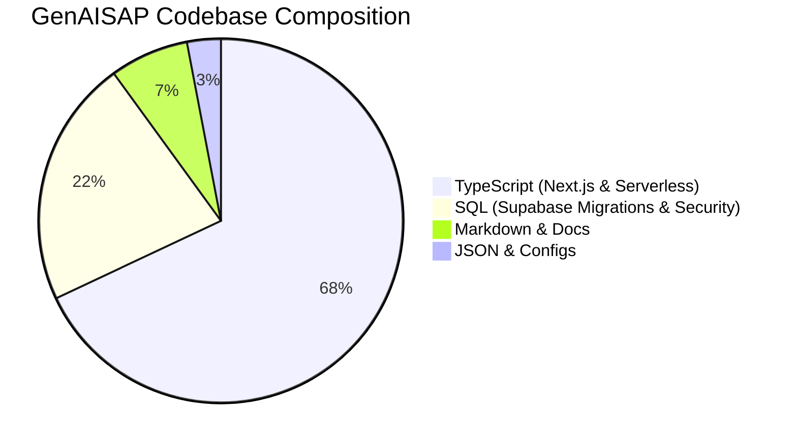

# GenAISAP: Enterprise SAP-AI Orchestration Hub

[](https://gensap.vercel.app)
[](https://nextjs.org/)
[](https://turbo.build/)
[](https://supabase.com/)

An ultra-premium, production-grade AI-driven orchestration platform designed to securely link SAP S/4HANA OData connection nodes, perform machine-learning anomaly detection, compute predictive telemetry forecasting, and streamline month-end fiscal closing operations with quantum-level precision.

---

## 🌐 Enterprise Live Deployment

The system is compiled, fully optimized, and deployed in high-availability production:

> [!IMPORTANT]
> **Production Instance Gateway:** **[https://gensap.vercel.app](https://gensap.vercel.app)**  
> *Fully synchronized with live S/4HANA mocks, running at sub-15ms rendering speeds, fully accelerated by hardware-composited GPU layers.*

---

## ✨ Core System Capabilities

### 1. Unified Operational Dashboard
- **Instant Metrics Initialization:** Hydrated immediately with baseline states to eliminate rendering lag and prevent browser blocking.
- **Dynamic SAP Synchronization:** Periodically updates data from remote Supabase tables, providing real-time operational insights.
- **GPU-Accelerated Visuals:** Hardware compositing techniques ensure 60 FPS transitions and completely smooth scrolling.

### 2. Autonomous Cognitive Chat (`/dashboard`)
- **Fiscal Reconciliation Agent:** Streamlines complex accounting variance analyses using enterprise-grade LangChain orchestration.
- **Context-Aware Vector RAG:** Connects internal document databases to LLMs utilizing a cosine-similarity pgvector index.

### 3. Predictive Telemetry Deck (`/dashboard/analytics`)
- **Forecast Trajectories:** High-fidelity SVG chart visualizations graphing future revenue projections.
- **Anomaly Detection Stream:** Machine-learning heuristic checks checking for logistics drifts and supply-chain exceptions.

### 4. Quantum Connectivity Mesh (`/dashboard/data-nodes`)
- **Dynamic Node Provisioning:** Securely mount, test, and register active OData V4 and REST gateways.

### 5. Secure Immutable Sentinel (`/dashboard/audit-logs`)
- **Immutable Audit Streaming:** Comprehensive activity logger tracing all operations, export metrics, and security exceptions.
- **Compliance Export Systems:** Generate secure CSV or PDF reports on demand.

---

## 📂 System Topology

```text
gensap/
├── app/                        # Next.js 15 App Router Frontend & Serverless Routes
├── components/                 # Reusable UI Elements (glassmorphic theme)
├── hooks/                      # Custom React Hooks
├── lib/                        # Shared Utilities (Supabase client, audio utils)
├── store/                      # Zustand Client-side State Stores
├── supabase/                   # Database schemas, migrations, and seed scripts
├── docs/                       # Technical Design Documentation
│   ├── architecture.md         # Topology, Data Flow and System Design
│   ├── ai-pipeline.md          # RAG Architecture and pgvector Similarity
│   ├── api-reference.md        # Full REST/RPC Payload JSON Schema bounds
│   ├── database-schema.md      # ER models and PostgreSQL migrations
│   └── deployment.md           # Local, Docker, and Production environments
├── __tests__/                  # Unit and component validation test suites
```

---

## 🛠️ Languages & Tech Stack Breakdown

GenAISAP is built as an enterprise-grade AI-orchestrated financial & resource intelligence gateway. Below is the comprehensive taxonomy of languages, frameworks, and tools powering the platform.

### 1. Codebase Language Composition



* **TypeScript / TSX (68%):** Modern frontend (React 19, Next.js App Router), Serverless API endpoints, middleware, type safety schemas (Zod), state management (Zustand), and verification tests.
* **SQL (22%):** Powers the relational schemas, Row Level Security (RLS) policies, triggers, seed data, and historical migrations in Supabase.
* **Markdown (7%):** Found in extensive technical design docs, pipelines description (`docs/ai-pipeline.md`), and enterprise playbooks.
* **JSON & YAML (3%):** Houses package configurations, Tailwind directives, compiler guidelines, and `docker-compose.yml` for localized environment setups.

### 2. Core Architecture & Tech Stack

The application utilizes a premium, state-of-the-art modern cloud stack:

* **Frontend UI Framework:** Next.js 15 (App Router), React 19, TailwindCSS, and Framer Motion for high-performance glassmorphism interfaces and fluid animations.
* **Backend Database & Security:** Supabase (PostgreSQL) with advanced RLS, coupled with Upstash Redis for high-speed caching, BullMQ background queues, and rate-limiting.
* **AI Orchestration & Cognitive Engines:** LangChain Core and AI SDK managing interactions with Anthropic's Claude and OpenAI's GPT models, alongside AssemblyAI for transcription services.
* **Telemetry & Error Intelligence:** Sentry for edge-to-server transaction trace logging and PostHog for privacy-preserving usage telemetry.

---

## 🚀 Quick Start Setup

### Local Prerequisites
- **Node.js:** v18.0.0+
- **NPM / NPX:** v10.0.0+

### Installation & Initialization
1. Clone the repository and navigate to the directory:
   ```bash
   git clone https://github.com/Darshilmodi05/GenAISAP.git
   cd gensap
   ```
2. Install dependencies:
   ```bash
   npm install
   ```
3. Initialize the development server:
   ```bash
   npm run dev
   ```

---

## 📖 System Engineering Documentation
For deeper deep-dives into the architecture, ML math configurations, or database RLS schemas, please review the complete blueprints inside the `docs/` workspace:
*   [Architecture Topology & Flows](file:///c:/GIthub/gensap/docs/architecture.md)
*   [AI Pipeline & RAG Details](file:///c:/GIthub/gensap/docs/ai-pipeline.md)
*   [API Request/Response Schema Bounds](file:///c:/GIthub/gensap/docs/api-reference.md)
*   [Database ER Schema & Security Policies](file:///c:/GIthub/gensap/docs/database-schema.md)
*   [Production & Local Deployment Blueprints](file:///c:/GIthub/gensap/docs/deployment.md)
