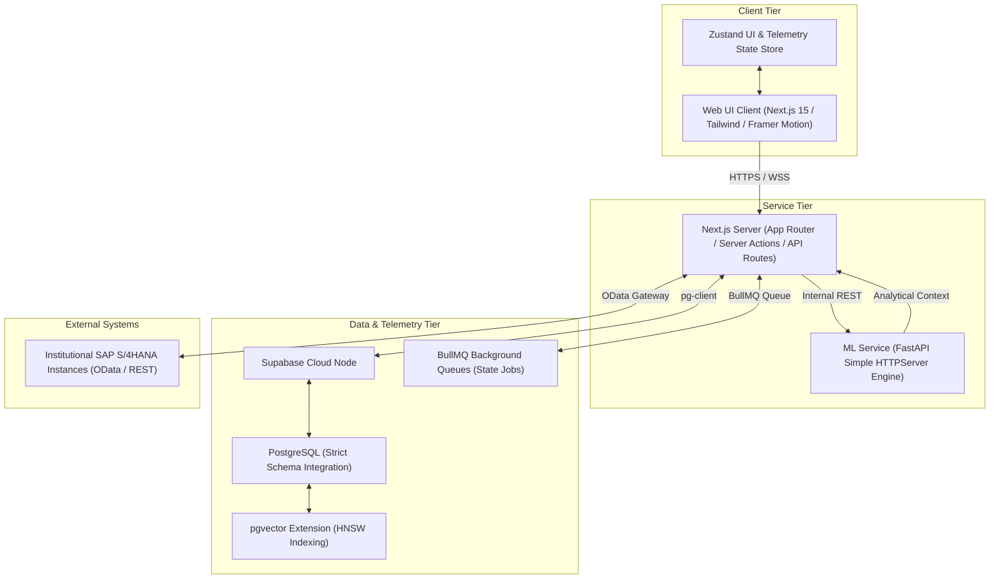

# GenAISAP System Architecture Documentation

Welcome to the official GenAISAP Enterprise System Architecture manual. This document details the high-fidelity component topology, multi-tier execution boundaries, and interactive telemetry data flows that govern the GenAISAP platform.

---

## 1. High-Level Component Topology

GenAISAP is structured as a modern monorepo orchestrated by **Turborepo**, separating core web experiences from modular Python-based machine learning environments and scalable backend infrastructure.

---

## 2. Monorepo Directory Boundaries

The workspace is organized to maximize resource sharing, linting uniformity, and build speed across all sub-applications:

*   **`apps/`**
    *   `apps/web/`: The Next.js 15 application. Contains visual dashboard interfaces, real-time AI Chat sessions, settings panels, and server-side metrics routing.
    *   `apps/ml-service/`: The Python FastAPI-inspired HTTPServer. Handles spike anomaly detection, series forecasting, heuristic transaction mapping, and narrative alert generation.
*   **`packages/`**
    *   `packages/api-client/`: Unified Axios-based TypeScript SDK wrapping both the Supabase client and Next.js internal endpoints.
    *   `packages/config/`: Standardized configurations (ESLint, TypeScript, Tailwind config templates).
    *   `packages/types/`: Central TypeScript models representing strict database schemas, API parameters, and UI types.
    *   `packages/ui/`: Shared custom visual components built using our premium design token system.
*   **`supabase/`**
    *   Contains SQL migrations (`supabase/migrations/`) defining tables, composite indexes, PL/pgSQL database functions, and Row-Level Security (RLS) policies.

---

## 3. Tiered System Boundaries & Technology Stack

### 3.1. Web UI Client & Server Tier
*   **Core Framework**: Next.js 15 (App Router, Server Actions, Dynamic Middleware Routing).
*   **Aesthetic Layer**: Tailwind CSS paired with a unified CSS variable engine (light/dark responsive mode tokens, HSL custom palette values, glassmorphic filters).
*   **Interactivity**: Framer Motion for smooth transitions, Lucid React for premium iconography.
*   **State Management**: Zustand lightweight storage nodes for immediate visual telemetry feedback and sidebar/layout options.

### 3.2. Machine Learning Engine (ML Service)
*   **Infrastructure**: Pure Python 3.11 with standard HTTP server interfaces (`HTTPServer`, `BaseHTTPRequestHandler`), optimized for zero-dependency container footprint.
*   **Capabilities**:
    *   *Anomaly Detection Module*: Statistical spike volume monitoring and duplicate postings tracking.
    *   *Cognitive Forecaster*: Rolling-window historical trend forecasting.
    *   *Evidence Compiler & Narrator*: Consolidates raw data telemetry with historical benchmarks to produce high-context natural language explanations.

### 3.3. Telemetry & Data Persistence Tier
*   **Database**: Supabase PostgreSQL with strict RLS policies enabled across all tables.
*   **Vector Operations**: `pgvector` for storing 1536-dimensional AI RAG embeddings, utilizing Hierarchical Navigable Small World (HNSW) indexes for fast cosine-similarity searches.
*   **Performance Cache**: Dedicated analytics and telemetry cache schemas with automatic TTL tracking and expiration triggers.

---

## 4. Interactive Transaction Sequence Flow

This diagram illustrates the end-to-end execution path when a user requests an AI-driven transaction audit from the dashboard:

```mermaid
sequenceDiagram
    autonumber
    actor User as Corporate Auditor
    participant Web as Next.js Web App
    participant ML as ML Service (Python)
    participant DB as PostgreSQL (Supabase)
    participant SAP as SAP S/4HANA ERP

    User->>Web: Request Audit Analysis (FICO Cluster)
    Web->>SAP: Fetch Delta Postings via OData (e.g. S4_ACDOCA_DELTA)
    SAP-->>Web: Return Raw Ledger Records (JSON)
    Web->>DB: Check & Update Analytics Cache (TTL Validated)
    
    rect rgb(30, 40, 80)
        note right of ML: Machine Learning Analysis Phase
        Web->>ML: POST /anomaly/detect-spikes (Raw Postings)
        ML->>ML: Execute Spike & Duplicate Detection
        ML->>ML: Compile Evidence & Call Narrative Generator
        ML-->>Web: Return Anomaly Vectors + AI Narratives
    end

    Web->>DB: Log Security Audit (public.audit_logs)
    Web->>DB: Write Alert Entries (public.alerts)
    Web-->>User: Render Beautiful Glass-Morphic Alert Deck & Lineage Trace
```

---

## 5. Security & Telemetry Data Flow

Data integrity and privacy are prioritized at every tier of the GenAISAP architecture:

1.  **Quantum-Safe Key Derivation**: All internal REST requests between Next.js and the Python ML service are signed using standard AES-256 HMAC tokens.
2.  **Row-Level Security (RLS)**: Enforced via Postgres profiles ensuring multi-tenant isolation. Users only query embeddings or messages matching their specific `organization_id`.
3.  **Encrypted Telemetry**: Real-time server performance statistics (errors, active users, latency) are compiled securely into `public.performance_analytics` for visualization in the System Governance Console.
