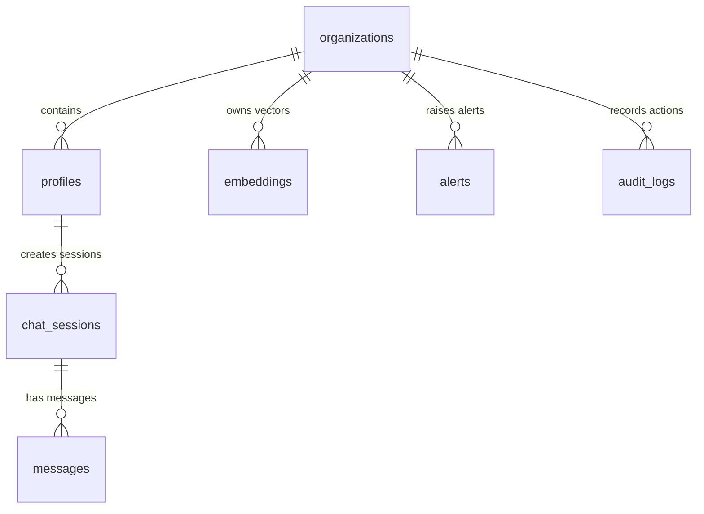

# GenAISAP Database Schema & Telemetry Tables

This document outlines the strict PostgreSQL database schema deployed via Supabase. All schemas are optimized for high-volume corporate transaction storage, fast vector searching, and thorough telemetry auditing.

---

## 1. Schema Relationships



---

## 2. Table Specifications

### 2.1. public.organizations
Manages tenant metadata and active corporate licensing.
*   `id` (uuid, Primary Key): Default `gen_random_uuid()`.
*   `name` (text, Not Null): Organization name.
*   `subscription_tier` (text, Not Null): Tier level (`enterprise`, `growth`, `basic`).
*   `created_at` (timestamp with time zone): UTC creation mark.

### 2.2. public.profiles
Enforces strict profile definitions tied to Supabase Auth.
*   `id` (uuid, Primary Key): References `auth.users(id)`.
*   `organization_id` (uuid): References `public.organizations(id)` on delete cascade.
*   `full_name` (text): Full user identity.
*   `role` (text): Role classification (`admin`, `auditor`, `user`).
*   `created_at` (timestamp with time zone).

### 2.3. public.chat_sessions
Maintains active LLM audit sessions.
*   `id` (uuid, Primary Key).
*   `user_id` (uuid): References `public.profiles(id)` on delete cascade.
*   `title` (text): Automatically summarized title.
*   `created_at` (timestamp with time zone).

### 2.4. public.messages (Strict Schema Compliance)
Logs structured audit and chat history containing precise AI execution diagnostics.
```sql
create table if not exists public.messages (
  id uuid primary key default gen_random_uuid(),
  session_id uuid references public.chat_sessions(id) on delete cascade not null,
  role text not null check (role in ('user', 'assistant', 'system')),
  content text not null,
  content_type text not null default 'text/markdown' check (content_type in ('text', 'text/markdown', 'structured')),
  ai_model text,
  tokens_used int,
  latency_ms int,
  confidence_score float,
  citations jsonb default '[]'::jsonb not null,
  created_at timestamp with time zone default timezone('utc'::text, now()) not null
);
```

### 2.5. public.embeddings (Vector Schema Compliance)
Stores parsed manuals and corporate directives as vectors.
```sql
create table if not exists public.embeddings (
  id uuid primary key default gen_random_uuid(),
  organization_id uuid references public.organizations(id) on delete cascade not null,
  source_type text not null check (source_type in ('sap_document', 'report', 'knowledge_base')),
  source_id uuid,
  content_chunk text not null,
  embedding vector(1536), -- 1536-dimensional float vector
  metadata jsonb default '{}'::jsonb not null,
  created_at timestamp with time zone default timezone('utc'::text, now()) not null
);
```

### 2.6. public.analytics_cache
Caches calculation loops for dashboard display speed.
```sql
create table if not exists public.analytics_cache (
  id uuid primary key default gen_random_uuid(),
  organization_id uuid references public.organizations(id) on delete cascade,
  metric_key text not null,
  sap_module text check (sap_module in ('FICO', 'SD', 'MM', 'HR', 'PP')),
  value jsonb default '{}'::jsonb not null,
  computed_at timestamp with time zone default timezone('utc'::text, now()) not null,
  expires_at timestamp with time zone not null
);
```

### 2.7. public.dashboard_metrics
Static telemetry cache tables populated by background collectors.
*   `id` (uuid, Primary Key).
*   `tenant_id` (text, Not Null): Default `'default'`.
*   `revenue_mtd` (text), `revenue_trend` (text).
*   `open_pos` (int).
*   `dso` (text), `dso_trend` (text).
*   `system_health` (text), `active_users` (int), `api_calls` (int), `data_sync` (text).

### 2.8. public.performance_analytics
Logs active system runtime health metrics.
*   `id` (uuid, Primary Key).
*   `timestamp` (timestamp with time zone, Not Null).
*   `active_users` (int, Not Null).
*   `total_requests` (int, Not Null).
*   `average_response_time` (float, Not Null).
*   `error_rate` (float, Not Null).
*   `top_endpoints` (jsonb): JSON listing of API usage.

### 2.9. public.alerts
Storage for AI-flagged transaction anomalies.
```sql
create table if not exists public.alerts (
  id uuid primary key default gen_random_uuid(),
  organization_id uuid references public.organizations(id) on delete cascade,
  alert_type text not null,
  severity text not null check (severity in ('low', 'medium', 'high', 'critical')),
  title text not null,
  description text,
  sap_module text check (sap_module in ('FICO', 'SD', 'MM', 'HR', 'PP')),
  affected_entities jsonb default '[]'::jsonb not null,
  status text not null default 'open' check (status in ('open', 'acknowledged', 'resolved')),
  detected_at timestamp with time zone default timezone('utc'::text, now()) not null,
  resolved_at timestamp with time zone
);
```

### 2.10. public.audit_logs
Strict operational history logs for System Governance tracing.
```sql
create table if not exists public.audit_logs (
  id uuid primary key default gen_random_uuid(),
  organization_id uuid references public.organizations(id) on delete cascade,
  user_id uuid references public.profiles(id) on delete set null,
  action text not null,
  resource_type text not null,
  resource_id text,
  metadata jsonb default '{}'::jsonb not null,
  ip_address text,
  user_agent text,
  created_at timestamp with time zone default timezone('utc'::text, now()) not null
);
```

---

## 3. Row-Level Security (RLS) Policies

All database items execute standard RLS paradigms to secure tenant boundaries.

### 3.1. Messages Policy Model
Users only modify records belonging to their active personal sessions:
```sql
alter table public.messages enable row level security;

create policy "Users can view messages in their sessions"
  on public.messages for select
  using (exists (
    select 1 from public.chat_sessions
    where public.chat_sessions.id = public.messages.session_id
      and public.chat_sessions.user_id = auth.uid()
  ));
```

### 3.2. Vector Embeddings Policy Model
Retrievals restricted to profiles matching the workspace owner's parent ID:
```sql
alter table public.embeddings enable row level security;

create policy "Users can view embeddings in their organization"
  on public.embeddings for select
  using (exists (
    select 1 from public.profiles
    where public.profiles.id = auth.uid()
      and public.profiles.organization_id = public.embeddings.organization_id
  ));
```
